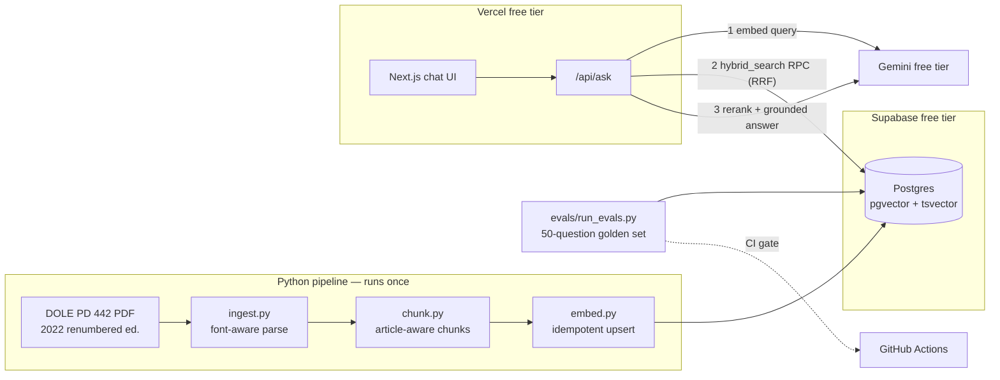

# Batas — Philippine Labor Code Q&A with receipts

[](https://github.com/your-username/batas-rag/actions/workflows/evals.yml)

Ask questions about the Philippine Labor Code and get answers grounded in the exact
articles — every claim cited as `[Art. N]`, every source inspectable, and a committed
eval harness that proves retrieval accuracy with numbers instead of vibes.
Runs entirely on free tiers: **$0/month**.

<!-- TODO(owner): record a 60–90s GIF of the demo and embed it here -->
<!--  -->

**Live demo:** _pending first Vercel deploy — see [Deploying](#deploying)_

> Educational demo — **not legal advice**.

## Eval results

50-question golden set: 20 direct, 20 colloquial paraphrases, 10 out-of-corpus traps
that must produce refusals. Reports live in [`evals/results/`](evals/results/) — the
commit history doubles as the tuning changelog.

| Metric | Value |
| --- | --- |
| hit@8 | _pending real-embedding baseline_ |
| MRR@8 | _pending real-embedding baseline_ |
| Trap refusal rate | _pending_ |

Current committed runs are harness self-tests with placeholder vectors (the corpus
hasn't been embedded with a real key yet). One measured win already in: switching the
keyword arm from `websearch_to_tsquery` (AND) to OR-joined lexemes took FTS-only
hit@8 from **0.075 → 0.600** on the golden set.

## Architecture



## Engineering decisions

**Why the DOLE renumbered edition, parsed from PDF.** The Labor Code was renumbered
in 2015 (DOLE Department Advisory 01-2015); anything citing "Art. 287 Retirement" is
pre-renumbering. The only official text carrying both numberings is the DOLE PDF, so
the pipeline parses that instead of the cleaner-looking 1974 HTML on the Official
Gazette — and keeps the old numbers as metadata (`Art. 302 [287]`). The PDF
interleaves footnotes with body text in reading order; fonts separate them (body
9.5pt, footnotes 5.5pt, markers superscript-flagged), so extraction filters by font
before any regex runs.

**Why article-aware chunking.** Legal retrieval has a natural unit: the article. A
chunk never spans two articles, so a citation can never be half-right. Each chunk
carries a breadcrumb header (`Book Three > Title I > Art. 87 (Overtime Work)`) —
cheap context that helps both the embedding and the keyword index.

**Why hybrid search, and what the evals changed.** Statute language and colloquial
language barely overlap ("graveyard shift" vs "night shift differential") — vectors
handle that; exact terms ("service incentive leave") favor keywords. Both arms run as
one Postgres RPC fused with Reciprocal Rank Fusion. The golden set caught that
Postgres's `websearch_to_tsquery` ANDs every word, matching almost nothing for
natural-language questions: OR-joined lexemes raised FTS-only hit@8 8×. Top-k is
deduped to the best chunk per article — duplicates were crowding out distinct
articles.

**Why the eval harness is the feature.** A RAG demo without numbers is a chatbot.
The golden set gates every retrieval change in CI (one batched embedding call — free
tier safe), and answer-mode evals run through the real `/api/ask` path measuring
citation presence and trap refusals. Reports are committed, so tuning history is
auditable in git.

**Why no LangChain.** The whole retrieval path is ~40 lines of SQL and two REST
calls. Building on the APIs directly keeps every step debuggable and provable —
there's nothing a framework would abstract here except the understanding.

**How $0/month shaped the design.** Python serving was ruled out (free Python hosting
cold-starts badly) — the pipeline is Python, serving is Next.js API routes on Vercel.
The per-IP rate limiter (hashed IPs, one Postgres count query) exists so a single
visitor can't drain the Gemini free quota. Embeddings are hash-keyed and idempotent
so re-runs cost zero API calls. The reranker is a flag (`RERANK_ENABLED`) that fails
open when quota is tight.

## Repo layout

```
pipeline/   ingest.py → chunk.py → embed.py  (Python 3.12, pydantic)
evals/      golden_set.jsonl, run_evals.py, results/ (committed reports)
web/        Next.js app — chat UI + /api/ask + /api/feedback
supabase/   schema.sql — tables, HNSW + GIN indexes, hybrid_search RPC
```

## Local setup

Prereqs: Python 3.12 + [uv](https://docs.astral.sh/uv/), Node 20+, a Postgres with
pgvector (Supabase free project, or locally:
`docker run -d -e POSTGRES_PASSWORD=test -p 54329:5432 pgvector/pgvector:pg16`).

```bash
cp .env.example .env        # fill in keys (see comments in the file)
make setup                  # venv + deps
make pipeline               # ingest → chunk → embed (idempotent)
make evals                  # retrieval metrics on the golden set
cd web && npm install && npm run dev
```

Windows (PowerShell) equivalents:

```powershell
uv venv -p 3.12 .venv; uv pip install -p .venv -r pipeline/requirements.txt
.venv\Scripts\python pipeline\ingest.py
.venv\Scripts\python pipeline\chunk.py
.venv\Scripts\python pipeline\embed.py
.venv\Scripts\python evals\run_evals.py
```

No Gemini key yet? `FAKE_EMBEDDINGS=1` exercises the full pipeline mechanically with
placeholder vectors (and eval runs take `--fake`), clearly labeled in reports.

## Deploying

1. **Supabase** (free): create a project, paste `supabase/schema.sql` into the SQL
   editor. Grab the URL + service-role key (Settings → API) and the connection-pooler
   URI (Settings → Database) for `DATABASE_URL`.
2. **Google AI Studio** (free): create an API key → `GEMINI_API_KEY`.
3. Run the pipeline once (`make pipeline`) to populate the index.
4. **Vercel** (Hobby): import the repo, set root directory to `web/`, add env vars
   `GEMINI_API_KEY`, `SUPABASE_URL`, `SUPABASE_SERVICE_ROLE_KEY`, `IP_HASH_SALT`.
5. **GitHub Actions**: add `GEMINI_API_KEY` and `DATABASE_URL` as repo secrets so the
   eval gate runs on PRs.

## License

[MIT](LICENSE). The Labor Code text is a public-domain government work.
